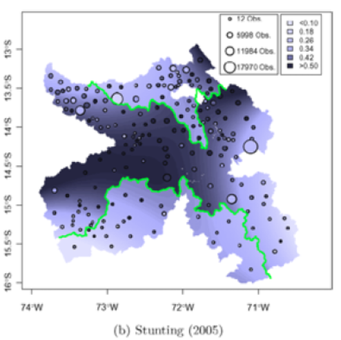
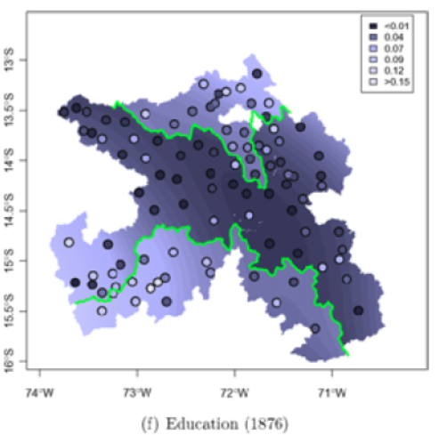
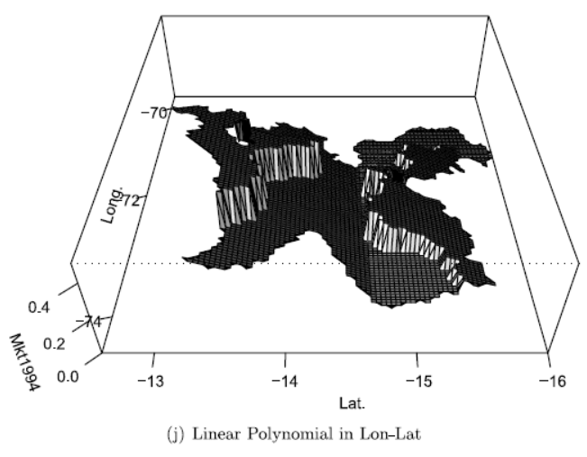

## Natural Experiments in History

# Geographic regression discontinuity designs (RDD)

See [Jupyter Notebook for backgrounder on RDD](RDD_R.ipynb)

---

## The Persistent Effects of Peru's Mining Mita

Dell, Melissa. 2010. “The Persistent Effects of Peru’s Mining ‘Mita.’” *Econometrica* 78 (6): 1863–1903.

---

---

### Mining and the Spanish Conquest of Peru

- In colonial Peru and Bolivia, a major economic activity was mining, based at Potosí (silver) and Huancavelica (mercury). 

- To support the mines, from 1573 to 1812, indigenous communities were forced to send 1 of 7 of their adult male population to work in the mines. 

- Local native elites were required to find the conscripts. What might this do?  In addition to direct health effects on the conscripts (high mortality rate), might reduce trust, undermine institutions, encourage out migration, make local labor scarce. 

---
The Mita had a well-defined border

---

- In early 17th century Potosi had a pop. of 200,000, larger than London, Milan or Seville at the time. At one point 70% of world silver production came from 'Cerro Rico' mountain of Potosi.
- daily quota of 25 bags of silver ore, each weighing around 45kg, to the surface .
- Mita boundary established a discontinuity in longitude-latitude space.

- Valid RD design requires all relevant factors besides treatment to vary smoothly at *mita* border.  Study segment used has statistically identical elevation, ethnic distribution and other observables.

---

### Estimation

$$
c_{idb}=\alpha+\gamma\cdot mita_d+X_{id}' \beta+f(geolocation_d)+\phi_b+\epsilon_{idb}
$$

Observation $i$ in district $d$ along segment $b$ of *mita* boundary. $mita_d$ =1 if district contributed to *mita*.

$X_{id}$ = covariates (e.g. demographic variables, # of children and adults in HH). $f(geolocation_d)$ RD polynomial controls for smooth functions of geographic location (polynomial in *lat*, *lon* and interactions). 

$\phi_b$ = set of boundary segment FE that denote which of 4 equal lengthy boundary segments is closes to the observations's district capital.

------

**Identification.**  All relevant factors besides treatment vary smoothly at *mita* boundary:  $E[c_1|x,y] \text{ and } E[c_0|x,y] $ are continuous at the discontinuity threshold.

Test if true for important characteristics: elevation, terrain ruggedness, soil fertility, rainfall, ethnicity, preexisting settlement patterns, local 1572 tribute (tax) rates, and allocation of 1572 tribute revenues.

Robustness: try different specs for RD polynomial and different buffers around border from 50 -100 km.

---

### Long run impacts of the Mita

- Consumption in present day Mita areas is 25% lower
- 6% more height stunting in 6-9 years old students
  - This is an ATE.  Along the boundary estimated effect ranges from 0.5% to 11.5%.

------

- Diagrams in next slides are analogous to standard two-dimensional plots with one forcing variable (x)
- Here two forcing variables (x-longitude) and (y-latitude)
- Mita region sandwiched between non-Mita regions to North and South.
- Dot size indicates # of observations in district (at capital location). 
- Shading indicates predicted outcome variable. Cubic polynomial in lon-lat and the mita dummy.

---

---

---

---

### Market Participation

---

### Channels of Persistence

- Land tenure
- Public Goods
- Market Participation

---

### Land Tenure

- Peru was first parceled off into *encomiendas*.  Right to collect tribute. 
- Population falls rapidly due to disease and over-exploitation of labor, particularly in mining.
- *Mita* system partly effort to rationalize (1 in 7 ratio)
- *Haciendas* were discouraged in Mita areas to limit power of landlords politically and in labor market competition. Haciendas secluded peasants from Mita.
- Much lower concentration of Haciendas in Mita areas.
- Unequal but secure property rights.

---

### Land Tenure

- Mita abolished in 1812 as well as indigenous communal tenure that had been predominant.
- Did not replace it with enforceable peasant titling.  Led to *hacienda* expansion through land grabs and violence.
- Peasant rebellions, banditry and livestock rustling, property insecurity.
- 1969 land reform dissolved *haciendas*.  Much higher allocation of land to peasants outside *mita* catchment (20% of HH heads) compared to within (9%).

---

### Public Goods

- More schooling and education attainment outside *Mita* areas measured in 1876, 1940. Not significant by 2001
- Greater road density in non-mita

